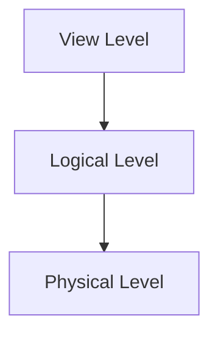

# 1. Introduction

 **데이터 베이스 관리 시스템(DBMS)**은 서로 관계있는 데이터들의 모임과 그 데이터에 접그낳기 위한 프로그램의 집합으로 구성된다.
 **데이터베이스(Database)**는 보통 이 데이터의 모임을 일컫는 말로서, 흔히 조직과 관련된 정보들을 포함한다. 데이터베이스는 대규모의 정보를 관리하도록 설계된다.

 ## 1.1 데이터베이스 시스템의 목적

 **전형적인 파일-처리 시스템(File-Processing System)**은 통상 운영체제에 의해 지원된다. 이러한 시스템에서는 영속적 레코드가 여러 가지 서로 다른 파일들에 저장되는 경우가 생기게 되는데, 이는 레코드를 검색하거나 새로 입력할 떄, 해당 파일에 따라 여러 가지 프로그램들이 서로 다르게 작성되어야 함을 의미한다.

 ### 파일 처리 시스템 사용 시 주요 단점

> **데이터의 중복과 비일관성** 파일과 응용 프로그램은 장기간에 걸쳐 서로 다른 많은 프로그래머들에 의해 개발되므로, 파일들이 다른 형식을 가지게 될 수 있다. 그리고 동일한 정보가 여러 파일에 중복 저장될 수 있다.

> **데이터 엑세스 시의 난점** 기존의 파일-처리 시스템 환경에서는 필요한 데이터를 편리하고 효울적으로 검색하기 힘들다. 애초에 그런 목적이 아니었기 때문이다. 보다 좋은 데이터 검색 시스템이 필요하다.

> **데이터의 고립** 데이터가 여러 파일에 흩어져 있는데다 파일 형식이 서로 다르기 때문에 원하는 데이터를 검색하는 프로그램을 작성하기 어렵다.

> **무결성(Integrity) 문제** 데이터베이스 내에 저장된 데이터 값들은 어떤 형식의 **일관성 조건(Consistency Constraint)**을 만족해야 한다. 프로그램 개발자는 여러 프로그램들 내에 적절한 코드를 첨가함으로써, 시스템 내에서 이런 제약 조건이 잘 지켜지도록 해야 한다.

> **원자성 문제** 데이터베이스의 일관성을 지키기 위해서는 반드시 연산 과정이 모두 이루어지든지 아니면 모두 이루어지지 않든지 해야 한다. 즉 해당 작업은 **원자적(Atomic)**이어야 한다. 기존의 파일-처리 시스템에서는 이런 과정을 보장하기가 어렵다.

> **동시 엑세스 문제** 시스템의 전반적인 성능을 향상시키고 응답 시간을 단축시키기 위해, 많은 시스템들은 여러 사용자가 데이터를 동시에 갱신할 수 있도록 한다. 동일한 데이터가 여러 사용자에 의해 동시에 갱신될 수 있는데, 이는 데이터의 비일관성을 야기할 수 있다.

> **보안 문제** 데이터베이스 시스템은 모든 사용자가 모든 데이터를 엑세스하는 것은 아니다. 파일-처리 시스템에서는 응용 프로그램이 그때그때 바로 추가되므로 이러한 보안에 관한 제약조건을 지키기 어렵다.

## 1.2 데이터의 관점

DBMS는 서로 관련이 있는 파일의 모임과 사용자로 하여금 이 파일들을 엑세스 하거나 수정하도록 하는 프로그램의 집합이다. 데이터베이스 시스템의 주요한 목적은 사용자에게 데이터에 관한 추성적인 관점을 제공하는 것이다.

### 1.3.1 데이터 추상화

> **물리적 단계(Physical level)** 추상화의 최하위 단계. 데이터가 실제로 어떻게(How) 저장되는지 기술한다. 물리적 단계에서는 복잡한 하위 단계의 데이터 구조들이 상세히 기술된다.

> **논리적 단계(Logical level)** 그 다음 상위 단계. 어떤(What) 데이터가 저장되었는지 그리고 데이터들 사이에는 어떤 관계가 있는지를 기술한다. 논리적 단계에서는 전체 데이터베이스를 몇 개의 비교적 간단한 데이터 구조를 이용하여 기술한다. 이러한 논리적 단계의 간단한 구조들을 구현하기 위해서는 복잡한 물리적 단계의 구조들을 알아야 하는 것이 사실이나, 논리적 단계의 사용자는 이러한 복잡한 구조에 대해 전혀 알 필요가 없다. 이것을 **물리적 데이터 독립성(Physical data independence)**라고 한다.

> **뷰 단계(View layer)** 추상화의 최상위 단계. 전체 데이터베이스의 일부만을 기술한다. 대부분의 데이터베이스 시스템 사용자는 데이터베이스에 저장된 모든 데이터에 관심이 있는 것이 아니라, 극히 일부분에만 관심이 있다. 뷰 단계에서는 이러한 사용자들이 시스템을 간단히 이용할 수 있도록 정의한다.




물리적 단계에서는 연속된 기억 장소에 위치한 하나의 불록 단위로 기술될 수 있다. 이 상세한 부분을 숨기지만 데이터베이스 관리자는 데이터의 물리적 구조를 상세하게 알고 있을 수도 있다.

논리작 단계에서는 각 레코드는 형 정의에 의 기술되며, 레코드들 사이의 관계도 이 단계에서 잘 정의되어 있어야 한다.

마지막으로, 뷰 단계에서 컴퓨터 사용자는 데이터형의 상세한 부분을 숨기고 있는 응용 프로그램을 사용한다. 이 단계에서 동일한 데이터베이스에 대해 여러 개의 뷰가 정의되고, 데이터베이스 사용자는 이러한 뷰의 일부 혹은 전체를 보게 된다.


### 1.3.2 인스턴스와 스키마

데이터베이스는 정보가 추가되고 삭제됨에 따라, 시시각각 변한다. 어느 특정한 순간에 데이터베이스에 저장되어 있는 정보의 모임을 데이터베이스의 **인스턴스(Instance)**라 한다. 이와 대조적으로 데이터베이스의 전체적인 설계를 이야기할 때는 데이터베이스 **스키마(Schema)**라 한다.

데이터베이스 시스템에는 추상화의 단계에 따라 여러 개의 스키마가 존재한다. **물리적 스키마(Physical Schema)**는 물리적 단계에서 데이터베이스 설계를 기술하며, **논리적 스키마(Logical Schema)**는 논리적 단계에서 데이터베이스 설계를 기술한다. 데이터베잇느ㅡㄴ 여러 가지 서로 다른 뷰를 기술하는 뷰 단계의 스키마를 여러 개 가질 수도 있는데, 이를 **서브 스키마(Subschema)**라 한다.

응용 프로그램이 물리적 스키마에 의존하지 않아서 물리적 스키마가 변경되어도 고칠 필요가 없는 것을 가리켜 **물리적 데이터 독립성(Physical data independence)**을 가졌다고 한다.


### 1.3.3 데이터 모델

데이터베이스 구조의 기반이 되는 것이 **데이터 모델(Data Model)**로서, 이는 데이터, 데이터들 사이의 관계, 데이터의 의미 그리고 일관성 제약조건 등을 기수라기 위한 개념적 표현들의 집합이다.


> **관계형 모델(Relational Model)** 관계형 모델(Relational Model)은 데이터와 이들 데이터 사이의 관계를 나타내기 위해 테이블들의 모임을 사용한다. 각 테이벌은 고유한 이름을 가진 여러 개의 열(Column)로 구성된다.

> **개체-관계 모델(Entity-Relationship Model)** 개체-관계 데이터 모델(E-R 모델)은 기본적인 객체들의 집한인 개체(Entity)들과 이러한 개체들 간의 관계(Relationship)를 사용한다. 개체는 실세계에 존재하는 '어떤 것' 혹은 '갹채'이며 다른 객체들과 구별된다.

> **객체-기반 데이터 모델(Object-Based Data Model)** 객체 지향 프로그래밍은 개체-관계 데이터 모델(Object-relational data model)은 객체-지향 데이터 모델과 관계형 데이터 모델의 특성을 결합한 모델이다.


## 1.4 데이터베이스 언어

데이터베이스 시스템은 데이터베이스 스키마를 기술하는 **데이터 정의 언어(Data Definition Language:DLL)**와 데이터 베이스 질의 및 갱신을 표현하는 **데이터 조작 언어(Data Manipulation Language:DML)**를 제공한다. 


### 1.4.1 데이터 조작 언어

**데이터 조작 언어(Data Manipulation Language:DML)**는 사용자가 적절한 데이터 모델로 구성된 데이터를 접근하거나 조작할 수 있도록 하는 언어이다. 접근의 형태는 다음과 같다.

> 데이터베이스 내에 저장된 정보를 검색
> 데이터베이스에 새로운 정보를 삽입
> 데이터베이스로부터 정보를 삭제
> 데이터베이스 내에 저장된 데이터를 수정

기본적으로 두 가지 형태의 DML이 있다.

> **절차식(Procedural) DML** 어떤 데이터가 필요하며 그 데이터를 어떻게 구할지 지정할 것을 요구한다

> **선언식(Declartive) DML(비절차식 DML(Nonprocedural DML))** 필요한 데이터를 어떻게 구할지 명시할 필요 없이, 어떠한 데이터가 필요한지 지정할 것만을 사용자에게 요구한다.

**질의(query)**는 정보의 검색을 요청하는 문장이다. 데이터 조작 언어에서 정보의 검색을 담당하는 부분을 **질의어(query language)**라고 한다. 


### 1.4.2 데이터 정의 언어

데이터베이스 스키마는 **데이터 정의 언어(Data Definition Language:DDL)**라는 특수한 언어로써 표현된 정의들의 집합으로 구체화된다. 또한 DDL은 데이터의 추가적인 특성을 표현하는 데에도 사용된다. 데이터베이스에 저장된 데이터들은 해당 데이터베이스가 요구하는 **일관성 제약조건**을 만족해야만 한다.

> **도메인 제약조건(Domain Constraints)** 가능한 값들의 도메은은 모든 속성들(Ex 정수형, 문자형, 날짜)과 연간되어 있어야 한다.

> **참조 무결성(Referential Integrity)** 주어진 속성들의 집합에 대한 릴레이션의 한 값이 다른 릴레이션에 대한 속성 집합의 값으로 반드시 나타나야 할 경우가 있다.

> **주장(Assertion)** 주장은 데이터베이스가 항상 만족시켜주어야 하는 조건이다. 도메인 제약 조건과 참조 무결성 제약조건은 주장의 특수한 형태이다.

> **권한(Authorization)** 데이터베이스의 다양한 데이터들에 대해서 사용자들마다 접근을 다르게 하고 싶을 때 이러한 차별을 일반적으로 **권한(Authorization)**이라고 한다. 읽기 권한, 삽입 권한, 갱신 권한, 삭제권한 등이 있따.


## 1.5 관계형 데이터베이스

관계형 데이터베이스는 관계형 모델에 기반하며 데이터와 데이터들의 관계를 나타내기 위해 테이블들의 집합을 사용한다. 관계형 데이터베이스는 또한 DML DDL을 포함한다.


### 1.5.1 테이블

각 테이블은 고유한 이름을 가진 여러 개의 열(Column)로 구성된다.

| ID      | name       | dept_name    | salary  |
| ------- | ---------- | ------------ | ------- |
| 22222   | Einstein   | Physics      | 95000   |      
| 22222   | Einstein   | Physics      | 95000   |
| 22222   | Einstein   | Physics      | 95000   |
| 22222   | Einstein   | Physics      | 95000   |
| 22222   | Einstein   | Physics      | 95000   |
| 22222   | Einstein   | Physics      | 95000   |
| 22222   | Einstein   | Physics      | 95000   |

a) The instructor Table


### 1.5.2 데이터 조작 언어

SQL 질의 언어는 비절차적 언어이다.

```
SELECT instructor.name
FROM instructor
WHERE instructor.dept_name = 'History'

```


```
SELECT instructor.ID, departname.dept_name
FROM instructor, department
WHERE instructor.dept_name = department.dpet_name
AND departnment.budget > 95000;

```


### 1.5.3 데이터 정의 언어

SQL은 테이블, 무결성 제약조건, 주장 들을 정의할 떄 많은 DDL을 제공한다.


```
CREATE TABLe department
(
    dept_name   CHAR(20),
    building    CHAR(15),
    budget      NUMERIC(12,2)   
);

```


## 1.6 데이터베이스 설계